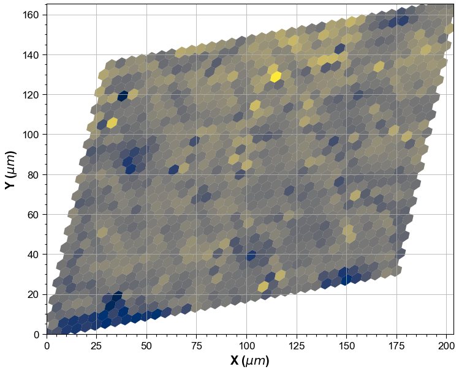

[](https://hexagonal.readthedocs.io/en/latest/?badge=latest)

# hexagonal
Hexagonal image handling library.



# Purpose
Hexagonal sampling of data gives us great advantages for the further data analysis. Despite the fact
hexagonal-grid-sampled image / data actually quite widely used, however it is also the disaster for
plotting and visualization at the outside of the tools which provided by vendor.

# Roadmap
- Hexagonal image parsing capability.
- Stable visualization.
- Hexagonal image indexing & nearest neighbour kernel.
- Kernel-based image data analysis.
- Rudimentary image processing capabilities.
- Optimization. Currently, approx ~2M pixels can be handled within an 'acceptable' timeframe.
- Hexagonal image container which contains image data, metadata, and transformation matrix.

# Current state
- Currently only visualization code has been implemented.
- Active development on-going. API will change rapidly.

# Installation
## conda
```bash
cd 'desired_package_location'
git clone https://github.com/polarity/hexagonal.git
conda activate 'your_environment_name'
conda develop .
```
